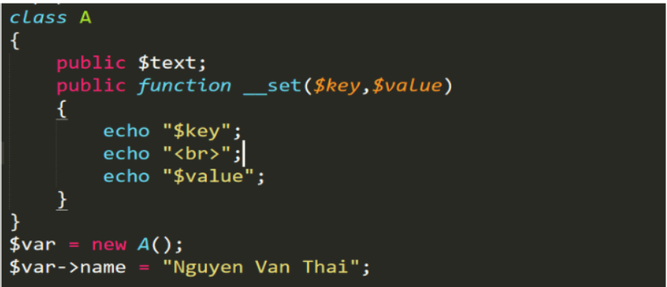
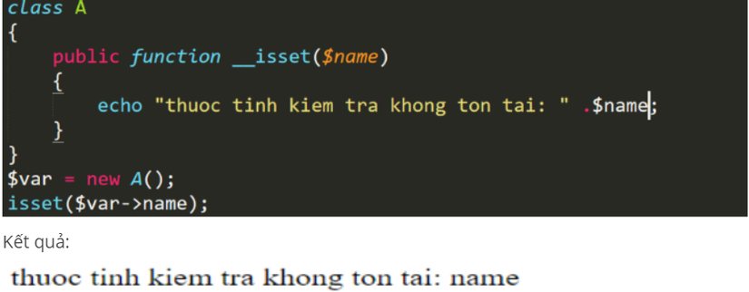
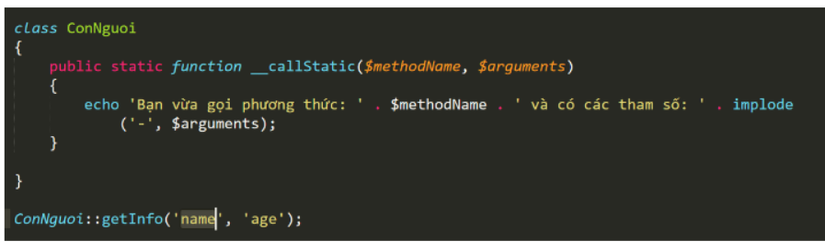

# Khai thác PHP Deserialization


Giống như JAVA, PHP giờ đây cũng đã hỗ trợ Object-Oriented Programming (OOP hay hướng đối tượng). Lập trình hướng đối tượng giúp lập trình viên kế thừa mã nguồn một cách hiêu quả hơn so với lập trình hướng cấu trúc. Không chỉ dừng lại với việc kế thừa mã nguồn, lập trình hướng đối tượng còn có các ưu điểm khác được thể hiện thông qua 4 tính chất của OOP như:

- Tính đóng gói (encapsulation)
- Tính kế thừa (Inheritance)
- Tính đa hình (polymorphism)
- Tính trừu tượng (abstraction)

Trong lập trình hướng đối tượng chương trình được tổ chức theo các lớp (Class). Lớp được hiểu như một khuôn mẫu của một đối tượng trong thực tế có thuộc tính (biến trong lập trình hướng cấu trúc) và phương thức (hàm trong lập trình hướng cấu trúc). Khi muốn thực hiện công việc nào đó ta sẽ tạo các thực thể của một lớp thể thực hiện công việc mong muốn.

Lớp cũng là một kiểu dữ liệu nhưng nó khác với các kiểu dữ liệu nguyên thủy đã biết như số nguyên (integer), chuỗi (string), boolean, do lớp chứa thuộc tính và phương thức. Vì vậy, để có thể lưu trữ, truyền tải qua mạng thì ta cần có một quy tắc để chuyển lớp sang dạng có thể lưu trữ cũng như có thể gửi qua các phương tiện truyền thông được. Để thực hiện điều đó PHP đưa ra 2 hàm: serialize, unserialize.

- serialize có nhiệm vụ chuyển một đối tượng sang dạng chuỗi để có thể lưu trữ cũng như gửi qua mạng.
- Unserialize chuyển chuỗi sang đối tượng tương ứng.

Để hiểu được tại sao lại có lỗ hổng này trước hết ta sẽ tìm hiểu hoạt động của hàm serialize và unserialize. Sau đó, ta sẽ tiến hành thực dụng lab demo lỗ hổng.

# Hoạt động của hàm serialize
Như đã nói qua ở trên, hàm serialize nhận đầu vào là một đối tượng và đầu ra là một chuỗi tương ứng với dữ liệu đầu vào. Để hình dung rõ hơn ta thực hiện một ví dụ nhỏ.
```php
<?php
    class User{
        public $username;
        public $status;
    }
    
    $user = new User;
    $user->username = 'cm0s';
    $user->status = 'labs';
    echo serialize($user);
?>
```
kết quả hiển thị ra khi `serialize`:
```php
O:4:"User":2:{s:8:"username";s:6:"vickie";s:6:"status";s:9:"not admin";}
```
- `O:4:"User"`: Chữ `O` là viết tắt của <b>Object</b>. Con số `4` là số ký tự của tên class, ở đây là "User".

- `:2` : Số `2` chỉ ra rằng object này có 2 thuộc tính (properties).

- `{...}`: Dấu ngoặc nhọn chứa tất cả các thuộc tính và giá trị của object.

- `s:8:"username"`: Chữ `s` là viết tắt của <b>String</b>. Con số `8` là số ký tự của tên thuộc tính, ở đây là "username".

- `s:6:"vickie"`: Đây là giá trị của thuộc tính "username". Nó là một chuỗi (`s`), có `6` ký tự, và giá trị là "vickie".

- `s:6:"status"`: Thuộc tính thứ hai, là một chuỗi (`s`), có `6` ký tự, và tên là "status".

- `s:9:"not admin"`: Giá trị của thuộc tính "status". Nó là một chuỗi (`s`), có `9` ký tự, và giá trị là "not admin".

Kết quả chuyển đổi từ object sang chuỗi phải tuân theo một cấu trúc nhất định.

# cấu trúc serialize
Cấu trúc serialize trong PHP có dạng `data-type:data`. Ví dụ, `b` là kiểu dữ liệu boolean
```
b:THE_BOOLEAN;
```
`i` là số nguyên
```
i:THE_INTEGER;
```
`b` là số thực
```
d:THE_FLOAT;
```
`s` là kiểu chuỗi
```
s:độ-dài-chuỗi:"giá trị";
```
`a` là mảng
```
a:số-lượng-phần-tử:{các-phần-tử}
```
Cuối cùng `o` đại diện cho một đối tượng.
```
O:độ-dài-lớp:"tên-lớp":số-lượng-thuộc-tính:{các-thuộc-tính}
```
Dựa vào mô tả cấu trúc trên ta dễ dàng hiểu được tại sao sau khi serialize lại có đầu ra là một chuỗi dài như trên.
# Hoạt động của hàm unserialize
Ngược lại với hàm serialize, hàm unserialize nhận đầu vào là một chuỗi tuân theo cấu trúc serialize chuyển thành một đối tượng tương ứng. Thêm phần trực quan ta xem thêm một đoạn code nhỏ nữa.

```php
<?php
	class User{
		public $username;
		public $status;
	}

	$user = new User;
	$user->username = 'cm0s';
	$user->status = 'labs';
	$serialized_string = serialize($user);
	$unserialized_data = unserialize($serialized_string);
	var_dump($unserialized_data);
	var_dump($unserialized_data->status);
?>
```
Với đoạn code trên sẽ cho ra kết quả như sau


Đến đây ta đã hiểu được cơ bản hướng đối tượng hay OOP là gì. Và cũng hiểu được cách để serialize và unserialize đối tượng như nào. Tiếp theo ta sẽ tìm hiểu tại sao khi unserialize lại có thể bị khai thác và tìm hiểu lý do tại sao. Đầu tiên ta sẽ tìm hiểu một vài <b>magic method</b> (mình để nguyên vì khi dịch ra tiếng Việt không hay) trong PHP. Những hàm này là một phần nguyên nhân dẫn đến việc PHP deserialization bị khai thác.

`__wakeup()` là phương thức trong class được thực thi khi một object được gọi dậy. Trong trường hợp cụ thể này là khi hàm unserializtion chạy xong.

`__destruct()` phương thức trong class được thực hiện khi một object bị hủy bỏ hay không còn tồn tại trong chương trình nữa.

# Khai thác lỗ hổng PHP deserialization

Lỗ hổng PHP deserialization có thể giúp ta thực hiện được các tấn công như SQL injection, path traversal, code injection,... Tùy code bị lỗi như nào.

Để khai thác được lỗ hổng PHP deserialization cần có 2 điều kiện.

- Class phải sử dụng 1 trong 2 hàm __wakeup(), __destruct() để xử lý dữ liệu người dùng.
- Người dùng có thể chèn dữ liệu độc hại vào hàm unserialize().

Để cho tường minh thêm ta sẽ làm thêm một ví dụ nữa.
```php
 class User {
        private $role;

        function __construct($role) {
            $this->role = $role;
        }

        function __wakeup() {
            if (isset($this->role)) eval($this->role);
        }
    }

$user_data = unserialize($_COOKIE['data']);
```
Ta cùng phân tích qua đoạn code trên xác định lỗ hổng và khả năng khai thác.

- Đoạn code trên nhận dữ liệu từ người dùng nhập vào (lấy dữ liệu qua `$_GET`) mà không thực hiện bất kỳ biện pháp làm sạch hay lọc dữ liệu. Nên ta có thể chèn dữ liệu độc hại vào.
- Class `PHPdeserialization` có sử dụng hàm `__wakeup()` để thực thi dữ liệu người dùng truyền vào.

Từ 2 điều trên ta đã xác định được đoạn code trên có lỗi PHP deserialization. Lỗi này giúp ta thực hiện tấn công code injection do sử dụng hàm `eval()` để xử lý dữ liệu của người dùng nhập vào mà không thực hiện làm sạch.

Để thực hiện khai thác ta sẽ chèn payload sau vào <b>COOKIE</b> với thên data.
```php
O%3A4%3A%22User%22%3A1%3A%7Bs%3A10%3A%22%00User%00role%22%3Bs%3A10%3A%22phpinfo%28%29%3B%22%3B%7D
```
Kết quả là ra ta thực hiện được code PHP :


# Magic Methods Trong PHP
## 1. Magic methods là gì.
Magic methods là các phương thức đặc biệt để tùy biến các các sự kiện trong php. Hiểu đơn giản là nó cung cấp thêm cách để giải quyết một vấn đề. Magic methods được dùng để xử lý các đối tượng trong lập trình hướng đối tượng.
## 2. Ưu nhược điểm của magic methods.
Bất kì một cái gì đó đều có ưu và nhược điểm cả (không có gì là hoàn hảo).
### Ưu điểm
Từ khái niệm ở trên chúng ta có thể thấy được ưu điểm của magic methods :
- Giúp cho chúng ta tùy biến được các hành vi, thêm cách lựa chọn để xử lý một đối tượng trong php.
- Nó giúp cho chúng ta có thể thao tác với một đối tượng theo cách mình muốn.
### Nhược điểm
- Giúp cho chúng ta tùy biến được các hành vi, thêm cách lựa chọn để xử lý một đối tượng trong php.
- Nó giúp cho chúng ta có thể thao tác với một đối tượng theo cách mình muốn.
- Một magic methods có tốc độ chậm hơn các phương thức bình thường.

## 3, Các magic method trong PHP.
Tất cả các hàm magic methods được viết trong 1 class cụ thể mà khi ta thao tác với đối tượng của class đó mà tùy trường hợp các hàm magic methods ta đã khai báo trong class đó sẽ được thực hiện.
- Trong PHP hiện nay có 15 hàm magic methods :
### +__construct():
Hàm được gọi khi ta khởi tạo một đối tượng.  
Trong php thì magic method __construct() rất là phổ biến mà chúng ta hay thường gặp nhất. Hàm __construct() sẽ tự đông được gọi khi ta khởi tạo 1 đối tượng( còn được gọi là hàm khởi tạo).


Không giống như các ngôn ngữ lập trình hướng đối tượng như java hay C#. Trong PHP, hàm khởi tạo không cho phép chúng ta thực hiện việc overload, nó chỉ cho phép khởi tạo 1 đối tượng duy nhất ứng với method __contructs() được khai báo trong class(không khai báo mặc định là không truyền gì).  
Ví dụ :


Chúng ta thấy nó không thể khải tạo được biến thứ 2 do method __contruct() ta có tham số truyền vào.

Để khắc phục việc không cho overload, trong php có tùy biến như sau :


### + __destruct():
được gọi khi một đối tượng bị hủy. Mặc định khi kết thúc chương trình hoặc khi ta khai báo mới đối tượng đó sẽ bị hủy bỏ và gọi đến method __destruct().


Như trên ví dụ ta có thể thấy đối tượng tạo trước sẽ bị hủy sau khi chương trình kết thúc.

### + __set():
gọi khi ta truyền dữ liệu vào thuộc tính không tồn tại hoặc thuộc tính private trong đối tượng.


Nó truyền dưới dạng key => value. Như ở ví dụ trên, ta set giá trị cho thuộc tính name mà không tồn tại trong class. Nó sẽ gọi đến hàm __set() với $key là thuộc tính đã gọi, $value là giá trị đã gán.
Kết quả:


### + __get():
gọi khi ta truy cập vào thuộc tính không tồn tại hoặc thuộc tính private trong đối tượng. Tương tự như set, get là việc xử lý khi truy cập đối tượng.


### + __isset():
Phương thức `__isset()` sẽ được gọi khi chúng ta thực hiện kiểm tra một thuộc tính không được phép truy cập của một đối tượng, hay kiểm tra một thuộc tính không tồn tại trong đối tượng đó. Cụ thể là hàm `isset()` và hàm `empty()`.  
Chú ý: phương thức `__isset()` không sử dụng được với thuộc tính tĩnh.


### + __unset():
được gọi khi hàm `unset()` được sử dụng trong một thuộc tính không được phép truy cập. Tương tự như hàm isset. Khi ta Unset 1 thuộc tính không tồn tại thì method `__unset()` sẽ được gọi.


### + __call():
được gọi khi ta gọi một phương thức không được phép truy cập trong phạm vi của một đối tượng. Như vậy thì có thể thấy `__get()` và `__call()` cũng gần giống nhau. Có điều `__get()` gọi khi không có thuộc tính còn `__call()` khi phương thức không có.  
Ta cũng có thể dùng hàm `__call()` để thực hiện overload trong php.  
Khai báo : `__call($method_name, $parameter)`  
Trong đó:  
```
   $method_name là phương thức được gọi mà không tồn tại.
    $parameter: là tham số truyền vào( là mảng).
```


Chúng ta có thể thấy trong class test không hề có hàm `overloadFunction`. Khi ta gọi tới phương thức `overloadFunction` thì nó sẽ chạy hàm `__call()`.

### + __callstatic():
Được kích hoạt khi ta gọi một phương thức không được phép truy cập trong phạm vi của một phương thức tĩnh.


### + __toString():
Phương thức này được gọi khi chúng ta in echo đối tượng. Method `__toString()` sẽ bắt buộc phải trả về 1 dãy String.


### + __invoke():
Phương thức này được gọi khi ta cố gắng gọi một đối tượng như một hàm.


### + __Sleep():
Được gọi khi `serialize()` một đối tượng. Thông thường khi chúng ta `serialize()` một đối tượng thì nó sẽ trả về tất cả các thuộc tính trong đối tượng đó. Nhưng nếu sử dụng `__sleep()` thì chúng ta có thể quy định được các thuộc tính có thể trả về.


### + __wakeup:
Được gọi khi `unserialize()` đối tượng.


### + __set_state():
Được sử dụng khi chúng ta `var_export` một object.


### + __clone():
Được sử dụng khi chúng ta clone(sao chép 1 đối tượng thành 1 đối tượng hoàn toàn mới không liên quan đến đối tượng cũ) một object.


### + __debugInfo():
Được gọi khi chúng ta sử dụng hàm `vardump()`.


## kết luận
Trên là tổng quan về magic methods và cách sử dụng chúng. Việc sử dụng magic methods khá là hữu ích nhưng chúng ta cũng không lên lạm dụng vì nó chậm hơn methods thường.